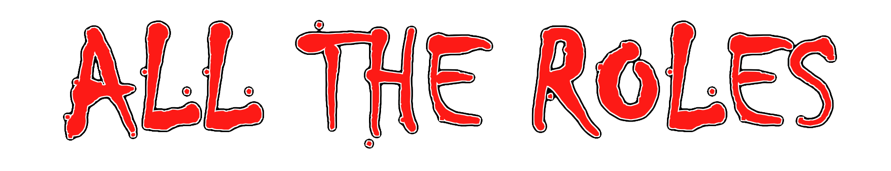

**All The Roles** is a mod for [Among Us](https://store.steampowered.com/app/945360/Among_Us) which adds many new [Roles](#roles), new [Map Settings](#map-settings) and new [Custom Hats](#custom-hats) to the game.
Even more roles are coming soon. :)

| Impostors | Crewmates | Neutral | Modifier |
|----------|-------------|-----------------|----------------|
| [Grenadier](#grenadier)       | [Detective](#detective)       | [Amnesiac](#amnesiac)             | [Bait](#bait)                 |
| [Morphling](#morphling)       | [Haunter](#haunter)           | [Guardian Angel](#guardian-angel) | [Diseased](#diseased)         |
| [Swooper](#swooper)           | [Investigator](#investigator) | [Survivor](#survivor)             | [Torch](#torch)               |
| [Morphling](#morphling)       | [Mystic](#mystic)             | [Executioner](#executioner)       | [Drunk](#drunk)               |
| [Poisoner](#poisoner)         | [Seer](#seer)                 | [Jester](#jester)                 | [Blind](#blind)               |
| [Traitor](#traitor)           | [Snitch](#snitch)             | [Phantom](#phantom)               | [Button Barry](#button-barry) |
| [Possessor](#possessor)       | [Spy](#spy)                   | [Arsonist](#arsonist)             | [Flash](#flash)               |
| [Blackmailer](#blackmailer)   | [Trapper](#trapper)           | [Plaguebearer](#plaguebearer)     | [Giant](#giant)               |
| [Janitor](#janitor)           | [Sheriff](#sheriff)           | [Glitch](#glitch)                 | [Lovers](#lovers)             |
| [Miner](#miner)               | [Veteran](#veteran)           | [Juggernaut](#juggernaut)         | [Sleuth](#sleuth)             |
| [Undertaker](#undertaker)     | [Vigilante](#vigilante)       | [Werewolf](#werewolf)             | [Tiebreaker](#tiebreaker)     |
| [Camouflager](#camouflager)   | [Altruist](#altruist)         | [Lawyer](#lawyer)                 | [VIP](#vip)                   |
| [Bounty Hunter](#bounty-hunter) | [Medic](#medic)             | [Vulture](#vulture)               | [Bloody](#bloody)             |
| [Warlock](#warlock)           | [Engineer](#engineer)         | [Shifter](#shifter)               | [Disperser](#disperser)       |
| [Witch](#witch)               | [Mayor](#mayor)               | [Jackal](#jackal)                 | [Indomitable](#indomitable)   |
| [Ninja](#ninja)               | [Medium](#medium)             | [Bomber](#bomber)                 | [Radar](#radar)               |
| [Astral](#astral)             | [Swapper](#swapper)           | [Joker](#joker)                   | [Multitasker](#multitasker)   |
| [Hypnotist](#hypnotist)       | [Time Lord](#time-lord)       |                                   | [Underdog](#underdog)         |
| [Outlaw](#outlaw)             | [Transporter](#transporter)   |                                   | [Double Shot](#double-shot)   |
| [Scorpion](#scorpion)         | [Bodyguard](#Bodyguard)       |                                   | [Chameleon](#chameleon)       |
| [Ghoul](#ghoul)               |                               |                                   | |
| [Sniper](#sniper)             |                               |                                   | |

-----------------------
# Releases
| Among Us - Version| Mod Version | Link |
|----------|-------------|-----------------|
| 2022.10.25s & 2022.10.25e | v0.9.13 | [Download](https://github.com/Zeo666/AllTheRoles/releases/download/0.9.13/AllTheRoles-0.9.13.zip) |
| 2022.10.25s & 2022.10.25e | v0.9.12 | [Download](https://github.com/Zeo666/AllTheRoles/releases/download/0.9.12/AllTheRoles-0.9.12.zip) |
| 2022.8.24s & 2022.8.24e & 2022.9.20s & 2022.9.20e | v0.9.11 | [Download](https://github.com/Zeo666/AllTheRoles/releases/download/0.9.11/AllTheRoles-0.9.11.zip) |
| 2022.8.24s & 2022.8.24e & 2022.9.20s & 2022.9.20e | v0.9.10 | [Download](https://github.com/Zeo666/AllTheRoles/releases/download/0.9.10/AllTheRoles-0.9.10.zip) |
| 2022.8.24s & 2022.8.24e & 2022.9.20s & 2022.9.20e | v0.9.9 | [Download](https://github.com/Zeo666/AllTheRoles/releases/download/0.9.9/AllTheRoles-0.9.9.zip) |
| 2022.8.24s & 2022.8.24e & 2022.9.20s & 2022.9.20e | v0.9.8 | [Download](https://github.com/Zeo666/AllTheRoles/releases/download/0.9.8/AllTheRoles-0.9.8.zip) |
| 2022.8.24s & 2022.8.24e & 2022.9.20s & 2022.9.20e | v0.9.7 | [Download](https://github.com/Zeo666/AllTheRoles/releases/download/0.9.7/AllTheRoles-0.9.7.zip) |
| 2022.8.24s & 2022.8.24e | v0.9.6 | [Download](https://github.com/Zeo666/AllTheRoles/releases/download/0.9.6/AllTheRoles-0.9.6.zip) |
| 2022.8.24s & 2022.8.24e | v0.9.5 | [Download](https://github.com/Zeo666/AllTheRoles/releases/download/0.9.5/AllTheRoles-0.9.5.zip) |
| 2022.8.24s & 2022.8.24e | v0.9.4 | [Download](https://github.com/Zeo666/AllTheRoles/releases/download/0.9.4/AllTheRoles-0.9.4.zip) |
| 2022.8.24s & 2022.8.24e | v0.9.3 | [Download](https://github.com/Zeo666/AllTheRoles/releases/download/0.9.3/AllTheRoles-0.9.3.zip) |
| 2022.8.24s & 2022.8.24e | v0.9.2 | [Download](https://github.com/Zeo666/AllTheRoles/releases/download/0.9.2/AllTheRoles-0.9.2.zip) |
| 2022.8.24s & 2022.8.24e | v0.9.1 | [Download](https://github.com/Zeo666/AllTheRoles/releases/download/0.9.1/AllTheRoles-0.9.1.zip) |
| 2022.8.24s & 2022.8.24e | v0.9.0 | [Download](https://github.com/Zeo666/AllTheRoles/releases/download/0.9.0/AllTheRoles-0.9.0.zip) |

  
 Changelog 

  

    
 v0.9.13 

    <ul>
    <li>Added: Chameleon modifier</li>
    <li>Added: Blind and Multitasker to the guesser selection</li>
    <li>Updated: Disperser button graphics</li>
    <li>Updated: Button Barry button graphics</li>
    <li>Change: Vulture can now devour a dead body from report distance</li>
    <li>Fixed: Incorrect end game screens for everyone besides the host</li>
    <li>Fixed: Prevent traitor getting the guesser ability if they already have it</li>
    <li>Fixed: Plaguebearer icons appearing when turned traitor</li>
    <li>Fixed: Arsonist douse graphics should move with the current target</li>
    <li>Fixed: Bounty Hunter can't get their GA as a bounty target</li>
    <li>Fixed: Fix for dead people only having max light radius</li>
    <li>Fixed: Jackal Sidekick button timer correctly set after meeting</li>
    </ul>
  

  

    
 v0.9.12 

    <ul>
    <li>Works with Among Us version 2022.10.25</li>
    <li>Added: Submerged map compatibility</li>
    <li>Added: Self Transport ability to the Transporter</li>
    <li>Added: DoubleShot Impostor modifier</li>
    <li>Added: Shield break animation to the medic shield and first kill shield</li>
    <li>Added: Lighter/Darker labels for the Detective and Medium</li>
    <li>Added: ArsonistDouseRadius and ArsonistMaxPlayerDouse game settings</li>
    <li>Added: Duration settings for the Spy Admin ability, Medic Vitals ability and Investigator Cams ability</li>
    <li>Added: PossessorVent game setting</li>
    <li>Updated: Altruist Revive button graphics</li>
    <li>Updated: Medic Shield button graphics</li>
    <li>Updated: Vigilante Tracker button graphics</li>
    <li>Updated: Veteran Alert button graphics</li>
    <li>Updated: Guardian Angel Protect button graphics</li>
    <li>Updated: Morphling Morph button graphics</li>
    <li>Change: After being voted out the Vigilante spawns inside a random vent</li>
    <li>Change: Arsonist can now douse multiple players at a time based on a radius</li>
    <li>Change: Vulture can target dead bodies from further away</li>
    <li>Fixed: Plaguebearer can't infect the none grown up mini</li>
    <li>Fixed: Morphling name change no longer preceeds the animation</li>
    <li>Fixed: Roles with charges now don't have their button timers refreshed after meeting</li>
    <li>Fixed: Amnesiac should now get the guessing ability from remembering the Sheriff role</li>
    <li>Fixed: Plaguebearer becoming pestilence in the last 2 and causing an imp win</li>
    <li>Fixed: Mystic mind vision causing problems on shift</li>
    <li>Fixed: Jackal can't target sidekick unless canCreateSidekickFromImpostor is false</li>
    <li>Fixed: Vent button graphics not showing for the Traitor</li>
    <li>Fixed: Detective & Medium should not get souls or chalk oultines for those killed during a meeting</li>
    <li>Fixed: You can't throw the bomb onto a mini player that hasn't grown up yet</li>
    <li>Fixed: Sniper weapon appearing larger on first use</li>
    </ul>
  

  

    
 v0.9.11 

    <ul>
    <li>Underdog is now a modifier</li>
    <li>Blind is now a crewmate modifier</li>
    <li>Added ShieldDisappearsOnAttack game setting</li>
    <li>Added ArsonistImpostorVision game setting</li>
    <li>Updated SeerButton graphics by HannahTheBeef</li>
    <li>First kill shield and medic shield now won't show up on morphed players</li>
    <li>Arsonist and Plaguebearer now have player icons to track doused and infected players</li>
    <li>Plaguebearer infection now spreads when an infected body is reported</li>
    <li>Glitch Hack now affects the Vent & Sabotage buttons</li>
    <li>Prevent all but crewmates and neutral benign from getting crewmate modifiers</li>
    <li>Mini can't be targeted or shot if not grown up</li>
    <li>Ghoul Scare now reduces the victims light radius</li>
    <li>Fixed: Sheriff can no longer kill a bodyguard if they shoot their target</li>
    <li>Fixed: Bodyguard and Medic icons now won't show on morphed players</li>
    <li>Fixed: Mini age now won't show on morphed players</li>
    <li>Fixed: Jackal lover exiled will now correctly promoted their sidekick</li>
    <li>Fixed: Astral being exiled as the lover of someone voted and not being actually dead</li>
    <li>Fixed: Bounty Hunter can't have a Mini target that hasn't grown up</li>
    <li>Fixed: Zoom out button not showing up</li>
    </ul>
  

  

    
 v0.9.10 

    <ul>
    <li>Added Mini modifier</li>
    <li>Added Radar modifier</li>
    <li>Added Multitasker modifier</li>
    <li>Added Survivor win end game screen</li>
    <li>Made some rendering improvements to the lobby settings</li>
    <li>Added Decoy delay timer before the Joker can use their decoy ability</li>
    <li>Updated Medium Mediate button graphics</li>
    <li>Updated Vigilante Tracker button graphics</li>
    <li>Ninja arrow has changed from black to red</li>
    <li>Scorpion arrow has changed from black to red</li>
    <li>Fixed: Swapper buttons to reset if one of the swap targets are killed in meeting</li>
    <li>Fixed: Swooper and Ninja properly hides the colourblind text during Invis</li>
    <li>Fixed: Fix for GA protection errorneous behaviour</li>
    <li>Fixed: Astral form should not show the zoom out/in buttons</li>
    <li>Fixed: Astral being able to see ghost chat in Astral form</li>
    <li>Fixed: End game occuring if Astral is in Astral form</li>
    <li>Fixed: Astral not being able to kill during astral form after the first time</li>
    <li>Fixed: Fix for 2 jackals vs 2 crew not winning</li>
    <li>Fixed: Morphling animation shouldn't occur during meetings</li>
    <li>Fixed: Giant modifier no longer shows during Camo Comms</li>
    <li>Fixed: Haunter and Phantom not being able to unvent at the start of a round</li>
    <li>Fixed: Killing a bodyguard when they protect their target but the attackers kill cooldown doesn't refresh</li>
    <li>Fixed: Lovers can't win if executioner win criteria is met</li>
    <li>Fixed: Kills before meeting now show correctly for everyone</li>
    </ul>
  

  

    
 v0.9.9 

    <ul>
    <li>Joker decoys no longer show their medic or bodyguard icons</li>
    <li>Joker decoys no longer show their medic shields</li>
    <li>Joker decoys no longer affected by medic shields</li>
    <li>Added cooldown for the shifter after meeting</li>
    <li>Updated Medic shield button graphics</li>
    <li>Updated Detective Inspect button graphics</li>
    <li>Changed guesser ghost chat message</li>
    <li>Updated TimeLord rewind button text colour to be the right colour for the role</li>
    <li>Executioner target now shows on the intro screen for the Executioner</li>
    <li>Spy can't be Executioner target</li>
    <li>Fixed: Pursuer blank button should only highlight when they have a target</li>
    <li>Fixed: Vulture and survivor being the last two players with no game end</li>
    <li>Fixed: Executioner target now changes on shift</li>
    <li>Fixed: Spy should not have any more vent and ladder movement issues anymore</li>
    <li>Fixed: Touching shouldn't cause the Veteran or Pestilence to die if KilledOnAlert setting is on</li>
    <li>Fixed: Warlock kill logic from breaking and causing odd behaviours</li>
    <li>Fixed: Amnesiac not being able to be shifted on or sidekicked</li>
    </ul>
  

  

    
 v0.9.8 

    <ul>
    <li>Added Better Polus game settings</li>
    <li>Spy can now be assassinated by impostors if setting selected</li>
    <li>Spy can be shot by the Sheriff is setting selected</li>
    <li>If Spy can be shot by impostors then impostors can kill other imposters</li>
    <li>If Spy can be assassinated by impostors then impostors can assassinate other imposters</li>
    <li>All custom button timers are reset on game start</li>
    <li>The transporter can now transport dead players</li>
    <li>Ghoul scare screen flash lasts the duration</li>
    <li>Updated text colour for the veteran alert button</li>
    <li>Can assasinate snitch via crewmate</li>
    <li>Clear Vigilante on shift</li>
    <li>Possessed message now renders until possession is over</li>
    <li>Swapper buttons are now hidden if a player is shot in meeting</li>
    <li>Kill buttons that are hidden for those imposters that don't need them are correctly hidden after a meeting</li>
    <li>Arsonist Douse, Bomber Place Bomb, Glitch Hack, Plaguebearer Infect and Shifter shift can be blanked and die on Alert or die touching Pestilence</li>
    <li>Fixed: Ninja should die to veteran and pestilence</li>
    <li>Fixed: Ninja should be correctly blanked by the Pursuer</li>
    <li>Fixed: Ninja button text not being set correctly after an assassination</li>
    <li>Fixed: Witch victim dying before anyone gets voted off causing unintended scenarios</li>
    <li>Fixed: The Bodyguard should now reset properly if they get shifted</li>
    <li>Fixed: Executioner not turing into amnesiac if that setting is selected</li>
    <li>Fixed: GA turning into crewmate when amnesiac is </li>
    <li>Fixed: Wrong guesses showing the correct dead chat message</li>
    <li>Fixed: If a possessed victim is brought back to life their buttons should be re-enabled</li>
    <li>Fixed: Shifter should now shift the guesser ability as well</li>
    <li>Fixed: Bomber place bomb button cooldown properly set</li>
    <li>Fixed: VIP flash no longer occuring when a Joker decoy is killed</li>
    <li>Fixed: Timelord revive will re-enable the buttons of a previously possessed player</li>
    <li>Fixed: Guesser dead chat message won't happen twice if lover is killed too</li>
    <li>Fixed: guesser dead chat being incorrect on a bad guess</li>
    <li>Fixed: Joker not spawning at the meeting table after a meeting</li>
    <li>Fixed: Warlock now affected by Pursuer Blank</li>
    <li>Fixed: Ninja assassinate no longer has a 5 second cooldown</li>
    <li>Fixed: Pestillence teleporting to the sniper when they are shot</li>
    <li>Fixed: Joker not dieing when their lover is killed</li>
    <li>Fixed: Joker not having to resample after pressing end decoy</li>
    </ul>
  

  

    
 v0.9.7 

    <ul>
    <li>Added Indomitable modifier</li>
    <li>Assassinate info is now sent to dead chat</li>
    <li>Mystic mind vision now has a cooldown setting</li>
    <li>Added a delay to the possess ability with game settings</li>
    <li>Reset possessor if target dies during delay</li>
    <li>Prevent the possessed from venting</li>
    <li>Added Possessed message for the possessed victim</li>
    <li>Prevent possess on dead targets or if the possessor is dead</li>
    <li>Fixed: Players having colours after a meeting when camo comms is on</li>
    <li>Fixed: While spectating a player and they are killed mind vision will not move with the ghost</li>
    </ul>
  

  

    
 v0.9.6 

    <ul>
    <li>Possessor now has a kill cooldown when they first possess someone</li>
    <li>Possessor kill button now shares a cooldown with the Possess kill button</li>
    <li>Possessor Possess button now has a delay timer after use</li>
    <li>Added new game settings: PossessKillCooldown & SidekickCanAssassin</li>
    <li>Updated guesser to hide buttons correctly</li>
    <li>When shifting onto a possessed player the buttons will be redisabled</li>
    <li>Buttons are now disabled when possessed</li>
    <li>Sidekick can now be a guesser if the setting is on</li>
    <li>Guesser can now guess the Sidekick when selecting Jackal</li>
    <li>Modifiers should now show up to the dead players</li>
    <li>Updated modifier text size and colour when revealModifier is true</li>
    <li>Sidekick can't get guessed if Jackal wasn't a guesser</li>
    <li>Arsonist can win with survivors and lawyers or when ignite is used</li>
    <li>Imposters can now zoom out when they are dead</li>
    <li>Fixed: Possessor should now be affected by the Diseased modifier after a kill</li>
    <li>Fixed: InspectChalkOutlineCastingDuration & MediateSoulCastingDuration settings being in the wrong tab screen</li>
    <li>Fixed: Hiding a map while possessed no longer re-enables the Report and Use buttons</li>
    <li>Fixed: Sniper weapon and guides now correctly disappear after death</li>
    <li>Fixed: Sidekick promotion issues</li>
    <li>Fixed: Mystic moving during mind vision</li>
    <li>Fixed: Possessor staying in control of their victim if they are killed</li>
    <li>Fixed: Medic shield flash not showing</li>
    <li>Fixed: Mystic mind vision should no longer spectate the target ghost if the target is dead</li>
    <li>Fixed: Astral being voted out or guessed and still counted as alive and keeping the game going</li>
    <li>Fixed: Shifting on a Joker decoy causing issues</li>
    <li>Fixed: Added missing roles from guesser selection</li>
    <li>Fixed: Joker now properly resets/clears when shifted</li>
    <li>Fixed: Mystic mind vision should now end properly after a meeting</li>
    <li>Fixed: The Witch Hex sprite shouldn't show in the meeting if the witch is already dead</li>
    <li>Fixed: The vigilante not being able to shoot those who are tracked</li>
    <li>Fixed: Vigilante arrows colours not being set correctly during camo comms</li>
    <li>Fixed: The bodyguard should not die if he has the first kill shield on</li>
    <li>Fixed: Icons should now show to all the dead players</li>
    <li>Fixed: Joker can now be killed by the Sheriff</li>
    <li>Fixed: Issue with Joker spawning outside the map after a meeting</li>
    <li>Fixed: Modifier's should not show to yourself when you're alive</li>
    <li>Fixed: Witch hex cooldown now set correctly</li>
    <li>Fixed: The black names of those doused by the Arsonist should not show when the Arsonist is dead</li>
    <li>Fixed: The black names of those infected by the Plaguebearer should not show when the Plaguebearer is dead</li>
    <li>Fixed: Plaguebearer infection not spreading on touch</li>
    </ul>
  

  

    
 v0.9.5 

    <ul>
    <li>Added Possessor Imposter role</li>
    <li>Added Mind Vision ability to the Mystic role</li>
    <li>Added spell casting settings for the Medium and Detective</li>
    <li>Combined both Medium buttons into one</li>
    <li>Combined both Detective buttons into one</li>
    <li>Added medic and bodyguard icons for their targets</li>
    <li>The sniper should no longer get the Shots Fired! message and screen flash</li>
    <li>A joker decoy with the VIP modifier should not notify everyone on death</li>
    <li>Fixed: Fixed error in CheckMurderAttempt with a shielded target</li>
    <li>Fixed: The sniper should no longer jump to the target of their snipe if the bodyguard protects the target and dies</li>
    </ul>
  

  

    
 v0.9.4 

    <ul>
    <li>Added Sniper imposter role</li>
    <li>Added Joker neutral role</li>
    <li>Added random map settings</li>
    <li>A Bomber victim can't throw the bomb back to the Bomber without dieing themselves</li>
    <li>Added petrify message for the ghoul</li>
    <li>Updated VIP flash colours to be faction specific</li>
    <li>Camo comms should now hide the Giant and the Flash</li>
    <li>Added screen flash when Jackal recruits a Sidekick</li>
    </ul>
  

  

    
 v0.9.3 

    <ul>
    <li>Added some extra last game first kill shield settings</li>
    <li>If a scoprion teleports an on alert vet or pestillence they will die</li>
    <li>The Bomber now has impostor vision and can vent via settings</li>
    <li>Updated end game summary text to highlight the winners</li>
    <li>Bug Fix: Vitals sboule be usable by players again</li>
    <li>Bug Fix: Game setting ids should no longer overlap and cause issues</li>
    <li>Bug Fix: Bomber place bomb button shouldn't go on cooldown if trying to place bomb on shielded player</li>
    <li>Bug Fix: Detective and Medium should now have the correct time of death in their reports</li>
    <li>Bug Fix: The Guardian Angel can no longer have the same target as the Lawyer</li>
    <li>Bug Fix: Certain game setting headers not showing when they should be always on</li>
    <li>Bug Fix: Vigilante should not be an executioner target</li>
    <li>Bug Fix: Morphling shouldn't slide around when the morph animation is playing</li>
    <li>Bug Fix: Vigilante no longer gets extra kill charges after meeting</li>
    </ul>
  

  

    
 v0.9.2 

    <ul>
    <li>Added Zoom In/Out button for ghosts when their tasks are complete</li>
    <li>Added sound effects for the bomb timer</li>
    <li>Bug Fix: Bomb outline should now show correctly when bomb is placed on a player</li>
    <li>Bug Fix: Bomb timer should no longer continue after death</li>
    <li>Bug Fix: Bomb timer should no longer continue after passing bomb to another player</li>
    </ul>
  

  

    
 v0.9.1 

    <ul>
    <li>Added Disperser imposter modifier</li>
    <li>Added Bomber neutral role</li>
    <li>Increased Arrow size</li>
    <li>Updated button barry custom button graphics</li>
    <li>Bug Fix: Fixed altruist arrows not showing for the bad guys</li>
    <li>Bug Fix: Vigi can no longer track a player already tracked</li>
    <li>Bug Fix: Tracking button should only highlight when the Vigilante has a current target</li>
    </ul>
  

  

    
 v0.9.0 

    <ul> 
    <li>Vigilante can no longer be voted off</li>
    </ul>
  

-----------------------
# Installation
## Requirements 
- Among Us
- Steam or Epic Games

## Windows Installation Steam
1. [Download](#releases) the All The Roles version corresponding to the installed Among Us version.
2. Go to your Steam library.
3. Right-click Among Us > click `Manage` > click `Browse local files`.
4. In the File Explorer, delete the entire `Among Us` folder.
5. Go back to your Steam library.
6. Right-Click Among Us > click `Properties...` > click `LOCAL FILES`.
7. Click on `VERIFY INTEGRITY OF GAME FILES...`.
8. Wait for Steam to download a clean version of Among Us.
9. Duplicate the new Among Us Folder.
10. Rename it to `Among Us - ATR`.
11. Double-click on the zip file you downloaded.
12. Drag all the files from the zip file in the new ToU folder.
13. Finally, launch `Among Us.exe` from that folder.

A first launch may take up to 5 minutes, so be patient if it doesn't launch immediately.

Not working? You might want to install the dependency [vc_redist](https://aka.ms/vs/16/release/vc_redist.x86.exe)

## Windows Installation Epic
1. [Download](#releases) the All The Roles version corresponding to the installed Among Us version.
2. Go to your Epic Games library.
3. Find Among Us and click on the 3 dots `...` > click `Uninstall`.
4. Confirm you want to Uninstall Among Us.
5. In the Epic library, click on Among Us to install.
6. Copy the Folder Path.
7. Uncheck Auto-Update.
8. Click on Install.
9. Click Yes on the Windows popup.
10. Paste the folder path in Windows search bar.
11. Click on Enter.
12. Copy or move the contents of the All The Roles zip file into the AmongUs folder.
13. Finally, launch Among Us from Epic Games library.

A first launch may take up to 5 minutes, so be patient if it doesn't launch immediately.

Not working? You might want to install the dependency [vc_redist](https://aka.ms/vs/16/release/vc_redist.x86.exe)

## Linux Installation
1. Install Among Us via Steam
2. Download newest [release](https://github.com/Zeo666/AllTheRoles/releases/latest) and extract it to ~/.steam/steam/steamapps/common/Among Us
3. Enable `winhttp.dll` via the proton winecfg (https://docs.bepinex.dev/articles/advanced/steam_interop.html#open-winecfg-for-the-target-game)
4. Launch the game via Steam

-----------------------
# Roles
# Crewmate Roles
## Detective
### **Team: Crewmates**
The Detective is a Crewmate that can examine other players for suspicious behaviour.\
If the player the Detective examines has killed recently the Detective will be alerted about it.\
After a meeting the Detective can view the chalk outlines of the recently dead and can analyse them for more information.

### Game Options
| Name | Description | Type | Default |
|----------|:-------------:|:------:|:------:|
| Detective | The percentage probability of the Detective appearing | Percentage | 0% |
| Examine Cooldown | The cooldown of the Detective's Examine button | Time | 10s |
| Bloody Duration | How long players remain bloody after a kill | Time | 25s |
| Show Detective Reports | Whether the Detective should get information when reporting a body | Toggle | True |
| Time Where Detective Reports Will Have Role | If a body has been dead for shorter than this amount, the Detective's report will contain the killer's role | Time | 15s |
| Time Where Detective Reports Will Have Faction | If a body has been dead for shorter than this amount, the Detective's report will contain the killer's faction | Time | 30s |
| Inspect Chalk Outline Casting Duration | The time that you need to stay next to the chalk outline in order to inspect it | Time | 1s |

-----------------------
## Haunter
### **Team: Crewmates**
The Haunter is a dead Crewmate that can reveal Impostors if they finish all their tasks.\
Upon finishing all of their tasks, Impostors are revealed to alive crewmates after a meeting is called.\
However, if the Haunter is clicked they lose their ability to reveal Impostors and are once again a normal ghost.

### Game Options
| Name | Description | Type | Default |
|----------|:-------------:|:------:|:------:|
| Haunter | The percentage probability of the Haunter appearing | Percentage | 0% |
| When Haunter Can Be Clicked | The amount of tasks remaining when the Haunter Can Be Clicked | Number | 5 |
| Haunter Alert | The amount of tasks remaining when the Impostors are alreted that the Haunter is nearly finished | Number | 1 |
| Haunter Reveals Neutral Roles | Whether the Haunter also Reveals Neutral Roles | Toggle | False |
| Who can Click Haunter | Whether even other Crewmates can click the Haunter | All / Non-Crew / Imps Only | All |

-----------------------
## Investigator
### **Team: Crewmates**
The Investigator is a Crewmate that can see the footprints of players.\
Every footprint disappears after a set amount of time.\
The Investigator can view the security cameras from anywhere on the map.

### Game Options
| Name | Description | Type | Default |
|----------|:-------------:|:------:|:------:|
| Investigator | The percentage probability of the Investigator appearing | Percentage | 0% |
| Footprint Size | The size of the footprint on a scale of 1 to 10 | Number | 4 |
| Footprint Interval | The time interval between two footprints | Time | 0.1s |
| Footprint Duration | The amount of time that the footprint stays on the ground for | Time | 10s |
| Anonymous Footprint | When enabled, all footprints are grey instead of the player's colors | Toggle | False |
| Footprint Vent Visible | Whether footprints near vents are shown | Toggle | False |
| Camera Charges | The number of times the Investigator can view cameras | Number | 4 |
| Camera Duration | The duration of one camera charge | Time | 10s |

-----------------------
## Mystic
### **Team: Crewmates**
The Mystic is a Crewmate that gets an alert revealing when someone has died.\
On top of this, the Mystic briefly gets an arrow pointing in the direction of the body.\
They Mystic can also see what other players are doing from their POV with the Mind Vision ability.

### Game Options
| Name | Description | Type | Default |
|----------|:-------------:|:------:|:------:|
| Mystic | The percentage probability of the Mystic appearing | Percentage | 0% |
| Mind Vision Cooldown | The Cooldown of the Mystic's Mind Vision button | Time | 25s |
| Mind Vision Duration | The duration of the Mystic's Mind Vision | Time | 10s |
| Arrow Duration | The duration of the arrows pointing to the bodies | Time | 0.1s |

-----------------------
## Seer
### **Team: Crewmates**
The Seer is a Crewmate that can reveal the alliance of other players.\
Based on settings, the Seer can find out whether a role is Good or Evil.\
A player's name will change color to their team.

### Game Options
| Name | Description | Type | Default |
|----------|:-------------:|:------:|:------:|
| Seer | The percentage probability of the Seer appearing | Percentage | 0% |
| Seer Cooldown | The Cooldown of the Seer's Reveal button | Time | 25s |
| Crewmate Killing show up as Evil | Crewmate Killing roles show up as Red | Toggle | False |
| Neutral Benign show up as Evil | Neutral Benign roles show up as Red | Toggle | False |
| Neutral Evil show up as Evil | Neutral Evil roles show up as Red | Toggle | False |
| Neutral Killing show up as Evil | Neutral Killing roles show up as Red | Toggle | False |
| Traitor does not swap Colours | The Traitor remains their original colour | Toggle | False |

-----------------------
## Snitch
### **Team: Crewmates**
The Snitch is a Crewmate that can get arrows pointing towards the Impostors, once all their tasks are finished.\
The names of the Impostors will also show up as red on their screen.\
Based on game settings, the Snitch may not know who they are until they have one task left.\
However, when they only have a single task left, the Impostors get an arrow pointing towards the Snitch.

### Game Options
| Name | Description | Type | Default |
|----------|:-------------:|:------:|:------:|
| Snitch | The percentage probability of the Snitch appearing | Percentage | 0% |
| Snitch knows who they are on Game Start | Whether the Snitch knows their role at the start of a game | Toggle | False |
| Snitch Sees Neutral Roles | Whether the Snitch also Reveals Neutral Roles | Toggle | False |
| Tasks Remaining When Revealed | The number of tasks remaining when the Snitch is revealed to Impostors | Number | 1 |
| Snitch Sees Impostors in Meetings | Whether the Snitch sees the Impostor's names red in Meetings | Toggle | True |
| Snitch Sees Traitor | Whether the Snitch sees the Traitor | Toggle | True |

-----------------------
## Spy
### **Team: Crewmates**
The Spy is a Crewmate that gains more information when on Admin Table and can open the admin table from anywhere on the map.\
On Admin Table, the Spy can see the colors of every person on the map.\
The Spy can also vent, and the Spy appears as an impostor to the other impostors.

### Game Options
| Name | Description | Type | Default |
|----------|:-------------:|:------:|:------:|
| Spy | The percentage probability of the Spy appearing | Percentage | 0% |
| Spy Can Die To Sheriff | Spy Can Die To Sheriff | Toggle | False |
| Spy Impostors Can Kill Anyone | Impostors Can Kill Anyone If There Is A Spy | Toggle | True |
| Spy Vent | Spy Can Vent | Toggle | True |
| Spy Has Impostor Vision | Whether the Spy has the same vision as the Impostors | Toggle | True |
| Admin Table Charges | The number of times the Spy can view the admin table | Number | 5 |
| Admin Table Duration | The duration of one admin table charge | Time | 10s |

-----------------------
## Trapper
### **Team: Crewmates**
The Trapper is a Crewmate that can place traps around the map.\
When players enter a trap they trigger the trap.\
In the following meeting, all players who triggered a trap will have their role displayed to the trapper.\
However, this is done so in a random order, not stating who entered the trap, nor what role a specific player is.

### Game Options
| Name | Description | Type | Default |
|----------|:-------------:|:------:|:------:|
| Trapper | The percentage probability of the Trapper appearing | Percentage | 0% |
| Min Amount of Time in Trap to Register | How long a player must stay in the trap for it to trigger | Time | 1s |
| Trap Cooldown | The cooldown on the Trapper's trap button | Time | 25s |
| Traps Removed Each Round | Whether the Trapper's traps are removed after each meeting | Toggle | True |
| Maximum Number of Traps Per Game | The number of traps they can place in a game | Number | 5 |
| Trap Size | The size of each trap | Factor | 1x |
| Minimum Number of Roles required to Trigger Trap | The number of players that must enter the trap for it to be triggered | Number | 3 |

-----------------------
## Sheriff
### **Team: Crewmates**
The Sheriff is a Crewmate that has the ability to eliminate the Impostors using their kill button.\
However, if they kill a Crewmate or a Neutral player they can't kill, they instead die themselves.\
During meetings, the Sheriff can choose to kill someone by guessing their role, however, if they guess incorrectly, they die instead.

### Game Options
| Name | Description | Type | Default |
|----------|:-------------:|:------:|:------:|
| Sheriff | The percentage probability of the Sheriff appearing | Percentage | 0% |
| Sheriff Miskill Kills Crewmate | Whether the other player is killed if the Sheriff Misfires | Toggle | False |
| Sheriff Kills Neutral | Whether the Sheriff is able to kill any Neutral bad guy | Toggle | False |
| Sheriff Kill Cooldown | The cooldown on the Sheriff's kill button | Time | 25s |
| Sheriff can report who they've killed | Whether the Sheriff is able to report their own kills | Toggle | True |
| Sheriff Meeting Kills | The number of kills the Sheriff can do with his ability | Number | 1 |
| Sheriff Multiple Kill  | Whether the Sheriff can kill more than once per meeting | Toggle | False |
| Sheriff Guess Neutral Benign  | Whether the Sheriff can Guess Neutral Benign roles | Toggle | False |
| Sheriff Guess Neutral Evil  | Whether the Sheriff can Guess Neutral Evil roles | Toggle | False |
| Sheriff Guess Neutral Killing  | Whether the Sheriff can Guess Neutral Killing roles | Toggle | False |
| Sheriff Guess Lovers  | Whether the Sheriff can Guess Lovers | Toggle | False |
| Sheriff Guess After Voting  | Whether the Sheriff can Guess after they have voted | Toggle | False |

-----------------------
## Veteran
### **Team: Crewmates**
The Veteran is a Crewmate that can go on alert.\
When the Veteran is on alert, anyone, whether crew, neutral or impostor, if they interact with the Veteran, they die.\
The veteran can also vent and if attacked while in a vent the perpetrator is killed instead.

### Game Options
| Name | Description | Type | Default |
|----------|:-------------:|:------:|:------:|
| Veteran | The percentage probability of the Veteran appearing | Percentage | 0% |
| Can Be Killed On Alert | Whether the Veteran dies when someone tries to kill them when they're on alert | Toggle | False |
| Alert Cooldown | The cooldown on the Veteran's alert button. | Time | 5s |
| Alert Duration | The duration of the alert | Time | 25s |
| Maximum Number of Alerts | The number of times the Veteran can alert throughout the game | Number | 3 |
| Veteran Can Vent | Whether the Veteran can vent | Toggle | False |

-----------------------
## Vigilante
### **Team: Crewmates**
The Vigilante is a Crewmate that has only one shot available to them.\
They can also track other players by tracking them during a round.\
Once they track someone, an arrow is continuously pointing to them, which updates in set intervals.\
The Vigilante can not be voted off in a meeting.

### Game Options
| Name | Description | Type | Default |
|----------|:-------------:|:------:|:------:|
| Vigilante | The percentage probability of the Vigilante appearing | Percentage | 0% |
| Vigilante Kill Cooldown | The cooldown on the Vigilante's kill button | Time | 25s |
| Arrow Update Interval | The time it takes for the arrow to update to the new location of the tracked player | Time | 5s |
| Track Cooldown | The cooldown on the Tracker's track button | Time | 25s |
| Tracker Arrows Reset Each Round | Whether Tracker Arrows are removed after each meeting | Toggle | False |
| Maximum Number of Tracks Per Round | The number of new people they can track each round | Number | 3 |

-----------------------
## Altruist
### **Team: Crewmates**
The Altruist is a Crewmate that is capable of reviving dead players.\
Upon finding a dead body, the Altruist can hit their revive button, risking sacrificing themselves for the revival of another player.\
If enabled, the dead body disappears, so only they Altruist's body remains at the scene.\
After a set period of time, the player will be resurrected, if the revival isn't interrupted.

### Game Options
| Name | Description | Type | Default |
|----------|:-------------:|:------:|:------:|
| Altruist | The percentage probability of the Altruist appearing | Percentage | 0% |
| Altruist Revive Duration | The time it takes for the Altruist to revive a dead body | Time | 10s |
| Target's body disappears on beginning of revive | Whether the dead body of the player the Altruist is reviving disappears upon revival | Toggle | False |
| Revive Charges | The number of times you can revive players before you die | Number | 3 |

-----------------------
## Medic
### **Team: Crewmates**
The Medic is a Crewmate that can give any player a shield that will make them immortal until the Medic dies.\
A Shielded player cannot be Shifted into, Hacked or Killed by anyone, unless by suicide.\
The Medic can view vitals from anywhere on the map.\
If the Medic reports a dead body, they can get a report containing clues to the Killer's identity.\
A report can contain the name of the killer or the color type (Darker/Lighter)

### Game Options
| Name | Description | Type | Default |
|----------|:-------------:|:------:|:------:|
| Medic | The percentage probability of the Medic appearing | Percentage | 0% |
| Show Shielded Player | Who should be able to see who is Shielded | Self / Medic / Self + Medic / Everyone | Self |
| Show Medic Reports | Whether the Medic should get information when reporting a body | Toggle | True |
| Time Where Medic Reports Will Have Name | If a body has been dead for shorter than this amount, the Medic's report will contain the killer's name | Time | 0s |
| Time Where Medic Reports Will Have Color Type | If a body has been dead for shorter than this amount, the Medic's report will have the type of color | Time | 15s |
| Who gets murder attempt indicator | Who will receive an indicator when someone tries to Kill them | Medic / Shielded / Everyone / Nobody | Medic |
| Shield breaks on murder attempt | Whether the Shield breaks when someone attempts to Kill them | Toggle | False |
| Vitals Charges | Number of charges you can view the vitals panel | Number | 5 |
| Vitals Duration | How long a single charge lasts for | Time | 10s |

-----------------------
## Engineer
### **Team: Crewmates**
The Engineer is a Crewmate that can fix sabotages from anywhere on the map.\
They can use vents to get across the map easily, and can seal them up too so noone else can enter or exit them.

### Game Options
| Name | Description | Type | Default |
|----------|:-------------:|:------:|:------:|
| Engineer | The percentage probability of the Engineer appearing | Percentage | 0% |
| Engineer Fix Per | Whether the Engineer can fix 1 sabotage per round or per game | Round / Game | Round |
| Engineer Seal Vent Cooldown | The cooldown of the Engineer's Seal Vent button | Time | 10s |
| Engineer Seal Vent Charges | Number of charges you can seal vents | Number | 5 |
| Engineer Seal Vents Next Round | Whether the vents are sealed immediately or after the next meeting | Toggle | False |

-----------------------
## Mayor
### **Team: Crewmates**
The Mayor is a Crewmate that can vote multiple times.\
The Mayor has a Vote Bank, which is the number of times they can vote.\
They have the option to abstain their vote during a meeting, adding that vote to the Vote Bank.\
As long as not everyone has voted, the Mayor can use as many votes from their Vote Bank as they please.

### Game Options
| Name | Description | Type | Default |
|----------|:-------------:|:------:|:------:|
| Mayor | The percentage probability of the Mayor appearing | Percentage | 0% |
| Initial Mayor Vote Bank | The number of votes in the Vote Bank at the start of a game | Number | 1 |
| Mayor Votes Show Anonymous | Whether the Mayor's extra votes will show up anonymously | Toggle | False |

-----------------------
## Medium
### **Team: Crewmates**
The Medium is a Crewmate that can see ghosts.\
During each round the Medium has an ability called Mediate.\
If the Medium uses this ability and no one is dead, nothing will happen.\
However, if someone is dead, the Medium and the dead player will be able to see each other and communicate from beyond the grave!\
After a meeting the Medium can view the souls of the dead and can ask them for more information.

### Game Options
| Name | Description | Type | Default |
|----------|:-------------:|:------:|:------:|
| Medium | The percentage probability of the Medium appearing | Percentage | 0% |
| Mediate Cooldown | The cooldown of the Medium's Mediate button | Time | 10s |
| Reveal Appearance of Mediate Target | Whether the Ghosts will show as themselves, or camouflaged | Toggle | True |
| Reveal the Medium to the Mediate Target | Whether the ghosts can see that the Medium is the Medium | Toggle | True |
| Who is Revealed | Which players are revealed to the Medium | Oldest Dead / Newest Dead / All Dead | Oldest Dead |
| Mediate Soul Casting Duration | The time that you need to stay next to a soul in order to get info from it | Time | 1s |

-----------------------
## Swapper
### **Team: Crewmates**
The Swapper is a Crewmate that can swap the votes on 2 players during a meeting.\
All the votes for the first player will instead be counted towards the second player and vice versa.

### Game Options
| Name | Description | Type | Default |
|----------|:-------------:|:------:|:------:|
| Swapper | The percentage probability of the Swapper appearing | Percentage | 0% |
| Swapper Can Button | Whether the Swapper Can Press the Button | Toggle | True |
| Swap After Voting | Swapper Can Swap After Voting | Toggle | True |

-----------------------
## Time Lord
### **Team: Crewmates**
The Time Lord is a Crewmate that can rewind time and reverse the positions of all players.\
If enabled, any players killed during this time will be revived.\
Nothing but movements and kills are affected.\
If enabled, the Time Lord can't use Vitals to make things more balanced.

### Game Options
| Name | Description | Type | Default |
|----------|:-------------:|:------:|:------:|
| Time Lord | The percentage probability of the Time Lord appearing | Percentage | 0% |
| Revive During Rewind | Whether the Time Lord revives dead players when rewinding | Toggle | False |
| Rewind Duration | How far the rewind goes back in time | Time | 2s |
| Rewind Cooldown | The cooldown of the Time Lord's Rewind button | Time | 25s |
| Max Uses | The amount of times the Rewind ability can be used | Number | 5 |
| Time Lord can use Vitals | Whether the Time Lord has the ability to use Vitals | Toggle | False |

-----------------------
## Transporter
### **Team: Crewmates**
The Transporter is a Crewmate that can change the locations of two random players at will.\
Players who have been transported are alerted with a blue flash on their screen.

### Game Options
| Name | Description | Type | Default |
|----------|:-------------:|:------:|:------:|
| Transporter | The percentage probability of the Transporter appearing | Percentage | 0% |
| Transport Cooldown | The cooldown of the Transporter's transport ability | Time | 25s |
| Max Uses | The amount of times the Transport ability can be used | Number | 5 |
| Transporter can use Vitals | Whether the Transporter has the ability to use Vitals | Toggle | False |
| Self Transport Cooldown | Self Transport Cooldown | Time | 25s |
| Self Transport Delay | Self Transport Delay | Time | 5s |

-----------------------
## Bodyguard
### **Team: Crewmates**
The bodyguard is a Crewmate that can protect another player from being killed and taking their place as the victim.

### Game Options
| Name | Description | Type | Default |
|----------|:-------------:|:------:|:------:|
| Bodyguard | The percentage probability of the Bodyguard appearing | Percentage | 0% |

-----------------------
## Pursuer
### **Team: Crewmates**
The Pursuer is a Crewmate role, but has a different goal to win the game; they have to be alive when the game ends and the Crew wins.\
In order to achieve this goal, the Pursuer has an ability called "Blank", where they can fill a killers (this also includes the Sheriff) weapon with a blank. So, if the killer attempts to kill someone, the killer will miss their target, and their cooldowns will be triggered as usual.\
If the killer fires the "Blank", shields (e.g. Medic shield or Time Master shield) will not be triggered.\
The Pursuer is a role that is only given to a player after the Lawyer, Executioner or Guardian Angel targets are killed.

### Game Options
| Name | Description | Type | Default |
|----------|:-------------:|:------:|:------:|
| Pursuer Blank Cooldown | The cooldown of the Pursuer's blank ability | Time | 10s | 
| Pursuer Number Of Blanks | The number of charges of the Pursuer's blank ability | Number | 5 |

-----------------------
# Neutral Roles
## Amnesiac
### **Team: Neutral**
The Amnesiac is a Neutral role with no win condition.\
They have zero tasks and are essentially roleless.\
However, they can remember a role by finding a dead player.\
Once they remember their role, they go on to try win with their new win condition.

### Game Options
| Name | Description | Type | Default |
|----------|:-------------:|:------:|:------:|
| Amnesiac | The percentage probability of the Amnesiac appearing | Percentage | 0% |
| Amnesiac Gets Arrows | Whether the Amnesiac has arrows pointing to dead bodies | Toggle | False |
| Arrow Appear Delay | The delay of the arrows appearing after the person died | Time | 5s |

-----------------------
## Guardian Angel
### **Team: Neutral**
The Guardian Angel is a Neutral role which aligns with the faction of their target.\
Their job is to protect their target at all costs.\
If their target loses, they lose.

### Game Options
| Name | Description | Type | Default |
|----------|:-------------:|:------:|:------:|
| Guardian Angel | The percentage probability of the Guardian Angel appearing | Percentage | 0% |
| Protect Cooldown | The cooldown of the Guardian Angel's Protect button | Time | 25s |
| Protect Duration | How long The Guardian Angel's Protect lasts | Time | 10s |
| Kill Cooldown Reset on Attack | The attackers kill cooldown after they attacked the protected target | Time | 2.5s |
| Max Uses | The amount of times the Protect ability can be used | Number | 5 |
| Show Protected Player | Who should be able to see who is Protected | Self / GA / Self + GA / Everyone | Self |
| Guardian Angel becomes on Target Dead | Which role the Guardian Angel becomes when their target dies | Crewmate / Amnesiac / Survivor / Jester | Crewmate |
| Target Knows GA Exists | Whether the GA's Target knows they have a GA | Toggle | False |
| GA Knows Targets Role | Whether the GA knows their target's role | Toggle | False |

-----------------------
## Survivor
### **Team: Neutral**
The Survivor is a Neutral role which can wins by simply surviving.\
However, if Lovers, or a Neutral Evil role wins the game, the survivor loses.

### Game Options
| Name | Description | Type | Default |
|----------|:-------------:|:------:|:------:|
| Survivor | The percentage probability of the Survivor appearing | Percentage | 0% |
| Vest Cooldown | The cooldown of the Survivor's Vest button | Time | 25s |
| Vest Duration | How long The Survivor's Vest lasts | Time | 10s |
| Kill Cooldown Reset on Attack | The attackers kill cooldown after they attacked the veste Survivor | Time | 2.5s |
| Max Uses | The amount of times the Vest ability can be used | Number | 5 |

-----------------------
## Jester
### **Team: Neutral**
The Jester is a Neutral role with its own win condition.\
If they are voted out after a meeting, the game finishes and they win.\
However, the Jester does not win if the Crewmates, Impostors or another Neutral role wins.

### Game Options
| Name | Description | Type | Default |
|----------|:-------------:|:------:|:------:|
| Jester | The percentage probability of the Jester appearing | Percentage | 0% |
| Jester Can Button | Whether the Jester Can Press the Button | Toggle | True |
| Jester Has Impostor Vision | Jester Has Impostor Vision | Toggle | True |
| Jester Can Vent | Whether the Jester Can Vent | Toggle | False |

-----------------------
## Executioner
### **Team: Neutral**
The Executioner is a Neutral role with its own win condition.\
Their goal is to vote out a player, specified in the beginning of a game.\
If that player gets voted out, they win the game.

### Game Options
| Name | Description | Type | Default |
|----------|:-------------:|:------:|:------:|
| Executioner | The percentage probability of the Executioner appearing | Percentage | 0% |
| Executioner becomes on Target Dead | Which role the Executioner becomes when their target dies | Crewmate / Amnesiac / Survivor / Jester | Crewmate |
| Executioner Can Button | Whether the Executioner Can Press the Button | Toggle | True |

-----------------------
## Phantom
### **Team: Neutral**
The Phantom is a Neutral role with its own win condition.\
They become half-invisible when they die and has to complete all their tasks without getting caught.

### Game Options
| Name | Description | Type | Default |
|----------|:-------------:|:------:|:------:|
| Phantom | The percentage probability of the Phantom appearing | Percentage | 0% |
| When Phantom Can Be Clicked | The amount of tasks remaining when the Phantom Can Be Clicked | Number | 5 |

-----------------------
## Arsonist
### **Team: Neutral**
The Arsonist is a Neutral role with its own win condition.\
They have two abilities, one is to douse other players with gasoline.\
The other is to ingite all doused players.\

### Game Options
| Name | Description | Type | Default |
|----------|:-------------:|:------:|:------:|
| Arsonist | The percentage probability of the Arsonist appearing | Percentage | 0% |
| Douse Cooldown | The cooldown of the Arsonist's Douse button | Time | 25s |
| Douse Duration | The time that you need to stay next to a target in order to douse them | Time | 1s |
| Arsonist Douse Radius | Douse Radius| Number | 1 |
| Arsonist Max Player Douse | Max Player Douse | Number | 1 |
| Arsonist Imposter Vision | Where the arsonist has imposter vision | Toggle | False |
| Arsonist Game End | Game Continues As Long As Arsonist Is Alive | Toggle | False |

-----------------------
## Plaguebearer
### **Team: Neutral**
The Plaguebearer is a Neutral role with its own win condition, as well as an ability to transform into another role.\
The Plaguebearer has one ability, which allows them to infect other players.\
Once infected, the infected player can go and infect other players via interacting with them.\
Once all players are infected, the Plaguebearer becomes Pestilence.\
The Pestilence is a unkillable force which can only be killed by being voted out, even their lover dying won't kill them.\
The Plaguebearer or Pestilence needs to be the last killer alive to win the game.

### Game Options
| Name | Description | Type | Default |
|----------|:-------------:|:------:|:------:|
| Plaguebearer | The percentage probability of the Plaguebearer appearing | Percentage | 0% |
| Infect Cooldown | The cooldown of the Plaguebearer's Infect button | Time | 25s |
| Pestilence Kill Cooldown | The cooldown of the Pestilence's Kill button | Time | 25s |
| Pestilence can Vent | Whether the Pestilence can Vent | Toggle | False |

-----------------------
## Glitch
### **Team: Neutral**
The Glitch is a Neutral role with its own win condition.\
The Glitch's aim is to kill everyone and be the last person standing.\
The Glitch can Hack players, resulting in them being unable to report bodies and do tasks.\
Hacking prevents the hacked player from doing anything but walk around the map.\
The Glitch can Mimic someone, which results in them looking exactly like the other person.

### Game Options
| Name | Description | Type | Default |
|----------|:-------------:|:------:|:------:|
| Glitch | The percentage probability of The Glitch appearing | Percentage | 0% |
| Mimic Cooldown | The cooldown of The Glitch's Mimic button | Time | 30s |
| Mimic Duration | How long The Glitch can Mimic a player | Time | 10s |
| Hack Cooldown | The cooldown of The Glitch's Hack button | Time | 30s |
| Hack Duration | How long The Glitch can Hack a player | Time | 10s |
| Glitch Kill Cooldown | The cooldown of the Glitch's Kill button | Time | 30s |
| Glitch Hack Distance | How far away The Glitch can Hack someone from | Short / Normal / Long | Short |
| Glitch can Vent | Whether the Glitch can Vent | Toggle | False |

-----------------------
## Juggernaut
### **Team: Neutral**
The Juggernaut is a Neutral role with its own win condition.\
The Juggernaut's aim is to kill everyone and be the last person standing.\

### Game Options
| Name | Description | Type | Default |
|----------|:-------------:|:------:|:------:|
| Juggernaut | The percentage probability of Juggernaut appearing | Percentage | 0% |
| Kill Cooldown | The cooldown of the Juggernaut's Kill button | Time | 25s |
| Kill Cooldown Reduction | The cooldown reduction of the Juggernaut's Kill button after a kill is made | Time | 5s |
| Juggernaut can Vent | Whether the Juggernaut can Vent | Toggle | False |

-----------------------
## Werewolf
### **Team: Neutral**
The Werewolf is a Neutral role with its own win condition.\
Although the Werwolf has a kill button, they can't use it unless they are Rampaged.\
Once the Werewolf rampages they gain Impostor vision and the ability to kill.\
However, unlike most killers their kill cooldown is really short.\
The Werewolf needs to be the last killer alive to win the game.

### Game Options
| Name | Description | Type | Default |
|----------|:-------------:|:------:|:------:|
| Werewolf | The percentage probability of the Werewolf appearing | Percentage | 0% |
| Rampage Cooldown | The cooldown of the Werewolf's Rampage button | Time | 25s |
| Rampage Duration | The duration of the Werewolf's Rampage | Time | 25s |
| Rampage Kill Cooldown | The cooldown of the Werewolf's Kill button | Time | 10s |
| Werewolf can Vent when Rampaged | Whether the Werewolf can Vent when Rampaged | Toggle | False |

-----------------------
## Lawyer
### **Team: Neutral**
The Lawyer is a neutral role that has a client.\
The client might be an Impostor or Jackal which is no Lover.\
Depending on the options, the client can also be a Jester.\
The Lawyer needs their client to win in order to win the game.\
Their client doesn't know that it is their client.\
If their client gets voted out, the Lawyer dies with the client.\
If their client dies, the Lawyer changes their role and becomes a different role (based on settings), which has a different goal to win the game.\
\
How the Lawyer wins:
- Lawyer dead/alive, client alive and client wins: The Lawyer wins together with the team of the client.
- If their client is Jester and the Jester gets voted out, the Lawyer wins together with the Jester.

**NOTE:**
- If the client disconnects, the Lawyer will also turn into the Pursuer
- The Lawyer needs to figure out the role of their client depending on the options

### Game Options
| Name | Description | Type | Default |
|----------|:-------------:|:------:|:------:|
| Lawyer | The percentage probability of the Lawyer appearing | Percentage | 0% |
| Lawyer Target Can Be The Jester | -  | Toggle | True |
| Lawyer Becomes On Target Dead | Lawyer Becomes On Target Dead | Crew / Amnesiac / Survivor / Jester / Pursuer | Crew |
| Lawyer Vision | Lawyer vision multiplier | Number | 1 |
| Lawyer Knows Target Role | Whether the lawyer can see their targets role | Toggle | True |

-----------------------
## Vulture
### **Team: Neutral**
The Vulture does not have any tasks, they have to win the game as a solo.\
The Vulture is a neutral role that must eat a specified number of corpses (depending on the options) in order to win.\
Depending on the options, when a player dies, the Vulture gets an arrow pointing to the corpse.\
If there is a Vulture in the game, there can't be a Cleaner.

### Game Options
| Name | Description | Type | Default |
|----------|:-------------:|:------:|:------:|
| Vulture | The percentage probability of the Vulture appearing | Percentage | 0% |
| Vulture Cooldown | Vulture Cooldown | Time | 25 |
| Number Of Corpses Needed To Be Eaten | Corpes needed to be eaten to win the game | Number | 3 |
| Vulture Can Use Vents | Vulture Can Use Vents | Toggle | True |
| Show Corpse Arrows | Show Arrows Pointing Towards The Corpes | Toggle | True |

-----------------------
## Shifter
### **Team: Neutral**
The shifter is a Neutral role that can steal another players role. If they try to steal an Impostor role however they will be killed.

### Game Options
| Name | Description | Type | Default |
|----------|:-------------:|:------:|:------:|
| Shifter | The percentage probability of the Shifter appearing | Percentage | 0% |
| Shifter Cooldown | Shifter Cooldown | Time | 30s |
| Shifter Who Shifts | Who gets the Shifter role on Shift | NoImps / RegCrew / Nobody | NoImps |
| Shift Modifiers | Modifiers included on Shift | Toggle | True |

-----------------------
## Jackal
### **Team: Jackal**
The Jackal is part of an extra team, that tries to eliminate all the other players.\
The Jackal has no tasks and can kill Impostors, Crewmates and Neutrals.\
The Jackal (if allowed by the options) can select another player to be their Sidekick.
Creating a Sidekick removes all tasks of the Sidekick and adds them to the team Jackal. The Sidekick loses their current role (except if they're a Lover, then they play in two teams).
The "Create Sidekick Action" may only be used once per Jackal or once per game (depending on the options).
The Jackal can also promote Impostors to be their Sidekick, but depending on the options the Impostor will either really turn into the Sidekick and leave the team Impostors or they will just look like the Sidekick to the Jackal and remain as they were.\
Also if a Spy or Impostor gets sidekicked, they still will appear red to the Impostors.

The team Jackal enables multiple new outcomes of the game, listing some examples here:
- The Impostors could be eliminated and then the crew plays against the team Jackal.
- The Crew could be eliminated, then the Team Jackal fight against the Impostors (The Crew can still make a task win in this scenario)

The priority of the win conditions is the following:
1. Crewmate Mini lose by vote
2. Jester wins by vote
3. Arsonist win
4. Team Impostor wins by sabotage
5. Team Crew wins by tasks (also possible if the whole Crew is dead)
6. Lovers among the last three players win
7. Team Jackal wins by outnumbering (When the team Jackal contains an equal or greater amount of players than the Crew and there are 0 Impostors left and team Jackal contains no Lover)
8. Team Impostor wins by outnumbering (When the team Impostors contains an equal or greater amount of players than the Crew and there are 0 players of the team Jackal left and team Impostors contains no Lover)
9. Team Crew wins by outnumbering (When there is no player of the team Jackal and the team Impostors left)

**NOTE:**
- The Jackal (and their Sidekick) may be killed by a Sheriff.
- A Jackal cannot target the Mini, while it's growing up. After that they can kill it or select it as its Sidekick.
- The Crew can still win, even if all of their members are dead, if they finish their tasks fast enough (That's why converting the last Crewmate with tasks left into a Sidekick results in a task win for the crew.)

If both Impostors and Jackals are in the game, the game continues even if all Crewmates are dead. Crewmates may still win in this case by completing their tasks. Jackal and Impostor have to kill each other.

### Game Options
| Name | Description | Type | Default |
|----------|:-------------:|:------:|:------:|
| Jackal | The percentage probability of the Jackal appearing | Percentage | 0% |
| Jackal/Sidekick Kill Cooldown | Kill cooldown | Time | 25s |
| Jackal Create Sidekick Cooldown | Cooldown before a Sidekick can be created  | Toggle | True |
| Jackal can use vents | Yes/No | Toggle | True |
| Jackal can create a Sidekick | Yes/No | Toggle | True |
| Jackals promoted from Sidekick can create a Sidekick | Yes/No (to prevent the Jackal team from growing) | Toggle | True |
| Jackals can make an Impostor to their Sidekick | Yes/No (to prevent a Jackal from turning an Impostor into a Sidekick, if they use the ability on an Impostor they see the Impostor as Sidekick, but the Impostor isn't converted to Sidekick. If this option is set to "No" Jackal and Sidekick can kill each other.) | Toggle | True |
| Jackal and Sidekick have Impostor vision | - | Toggle | True |

-----------------------
## Sidekick
### **Team: Jackal**
Gets assigned to a player during the game by the "Create Sidekick Action" of the Jackal and joins the Jackal in their quest to eliminate all other players.\
Upon the death of the Jackal (depending on the options), they might get promoted to Jackal themself and potentially even assign a Sidekick of their own.\
\
**NOTE:**
- A player that converts into a Sidekick loses their previous role and tasks (if they had one).
- The Sidekick may be killed by a Sheriff.
- The Sidekick cannot target the Mini, while it's growing up.

### Game Options
| Name | Description | Type | Default |
|----------|:-------------:|:------:|:------:|
| Jackal/Sidekick Kill Cooldown | Uses the same kill cooldown setting as the Jackal | Time | 25s |
| Sidekick gets promoted to Jackal on Jackal death |  Yes/No | Toggle | False |
| Sidekick can kill | Yes/No | Toggle | True |
| Sidekick can use vents | Yes/No | Toggle | True |

-----------------------
## Bomber
### **Team: Neutral**
The Bomber is a Neutral role that can plant bombs on other players\
and get them to kill for them or they die themselves when the timer ends.

### Game Options
| Name | Description | Type | Default |
|----------|:-------------:|:------:|:------:|
| Bomber | The percentage probability of the Bomber appearing | Percentage | 0% |
| Bomber Place Bomb Cooldown | The plant bomb cooldown | Time | 25s |
| Bomber Place Bomb PreTimer | The time is takes for the bomb victim to find out they have a bomb on them | Time | 5s |
| Bomber Bomb Timer | The time it takes for the bomb to explodes | Time | 20s |
| Bomber Bomb Indicator | Bomb Indicator Every X seconds | Time | 5s |
| Bomber Can Vent | Whether the Bomber can vent | Toggle | False |

-----------------------
## Joker
### **Team: Neutral**
The Joker is an Neutral role that can morph into decoys of other people.\
To win the Joker must get a number of those decoys killed to win.

### Game Options
| Name | Description | Type | Default |
|----------|:-------------:|:------:|:------:|
| Joker | The percentage probability of the Joker appearing | Percentage | 0% |
| Joker Decoy Cooldown | The cooldown of the Joker's Decoy button | Time | 25s |
| Number Of Decoys Needed To Be Killed | Decoys needed to be killed to win the game | Number | 3 |

-----------------------
# Impostor Roles
## Grenadier
### **Team: Impostors**
The Grenadier is an Impostor that can throw smoke grenades.\
During the game, the Grenadier has the option to throw down a smoke grenade which blinds crewmates so they can't see.\
However, a sabotage and a smoke grenade can not be active at the same time.

### Game Options
| Name | Description | Type | Default |
|----------|:-------------:|:------:|:------:|
| Grenadier | The percentage probability of the Grenadier appearing | Percentage | 0% |
| Flash Grenade Cooldown | The cooldown of the Grenadier's Flash button | Time | 25s |
| Flash Grenade Duration | How long the Flash Grenade lasts for | Time | 10s |
| Flash Radius | How wide the flash radius is | Factor | 1x |
| Indicate Flashed Crewmates | Whether the Grenadier can see who has been flashed | Toggle | False |
| Grenadier can Vent | Whether the Grenadier can Vent | Toggle | False |

-----------------------
## Morphling
### **Team: Impostors**
The Morphling is an Impostor that can Morph into another player.\
At the beginning of the game and after every meeting, they can choose someone to Sample.\
They can then Morph into that person at any time for a limited amount of time.

### Game Options
| Name | Description | Type | Default |
|----------|:-------------:|:------:|:------:|
| Morphling | The percentage probability of the Morphling appearing | Percentage | 0% |
| Morph Cooldown | The cooldown of the Morphling's Morph button | Time | 25s |
| Morph Duration | How long the Morph lasts for | Time | 10s |
| Morphling can Vent | Whether the Morphling can Vent | Toggle | False |

-----------------------
## Swooper
### **Team: Impostors**
The Swooper is an Impostor that can temporarily turn invisible.

### Game Options
| Name | Description | Type | Default |
|----------|:-------------:|:------:|:------:|
| Swooper | The percentage probability of the Swooper appearing | Percentage | 0% |
| Swooper Cooldown | The cooldown of the Swooper's Swoop button | Time | 25s |
| Swooper Duration | How long the Swooping lasts for | Time | 10s |
| Swooper can Vent | Whether the Swooper can Vent | Toggle | False |

-----------------------
## Poisoner
### **Team: Impostors**
The Poisoner is an Impostor who has to poison another play instead of kill.\
When they poison a player, the poisoned player dies either upon the start of the next meeting or after a set duration.

### Game Options
| Name | Description | Type | Default |
|----------|:-------------:|:------:|:------:|
| Poisoner | The percentage probability of the Poisoner appearing | Percentage | 0% |
| Poison Cooldown | The cooldown of the Poisoner's Poison button | Time | 25s |
| Poison Kill Delay | The delay of the kill after being poisoned | Time | 5s |
| Poisoner can Vent | Whether the Poisoner can Vent | Toggle | False |

-----------------------
## Traitor
### **Team: Impostors**
If all Impostors die before a certain point in the game, a random crewmate is selected to become the Traitor.\
The Traitor has no additional abilities and their job is simply to avenge the dead Impostors.\
Once this player has turned into the Traitor their alliance sits with the Impostors.

### Game Options
| Name | Description | Type | Default |
|----------|:-------------:|:------:|:------:|
| Traitor | The percentage probability of the Traitor appearing | Percentage | 0% |
| Latest Spawn | The minimum number of people alive when a Traitor can spawn | Number | 5 |
| Traitor Won't Spawn if Neutral Killing are Alive | Whether the Traitor won't spawn if any Neutral Killing roles are alive | Toggle | False |

-----------------------
## Blackmailer
### **Team: Impostors**
The Blackmailer is an Impostor that can silence people in meetings.\
During each round, the Blackmailer can go up to someone and blackmail them.\
This prevents the blackmailed person from speaking during the next meeting.

### Game Options
| Name | Description | Type | Default |
|----------|:-------------:|:------:|:------:|
| Blackmailer | The percentage probability of the Blackmailer appearing | Percentage | 0% |
| Initial Blackmail Cooldown | The initial cooldown of the Blackmailer's Blackmail button | Time | 10s |

-----------------------
## Janitor
### **Team: Impostors**
The Janitor is an Impostor that can clean up bodies.\
Both their Kill and Clean ability have a shared cooldown, meaning they have to choose which one they want to use.

### Game Options
| Name | Description | Type | Default |
|----------|:-------------:|:------:|:------:|
| Janitor | The percentage probability of the Janitor appearing | Percentage | 0% |

-----------------------
## Miner
### **Team: Impostors**
The Miner is an Impostor that can create new vents.\
These vents only connect to each other, forming a new passway.

### Game Options
| Name | Description | Type | Default |
|----------|:-------------:|:------:|:------:|
| Miner | The percentage probability of the Miner appearing | Percentage | 0% |
| Mine Cooldown | The cooldown of the Miner's Mine button | Time | 25s |

-----------------------
## Undertaker
### **Team: Impostors**
The Undertaker is an Impostor that can drag and drop bodies.

### Game Options
| Name | Description | Type | Default |
|----------|:-------------:|:------:|:------:|
| Undertaker | The percentage probability of the Undertaker appearing | Percentage | 0% |
| Undertaker Drag Cooldown | The cooldown of the Undertaker Drag ability | Time | 25s |
| Undertaker can Vent | Whether the Undertaker can Vent | Toggle | False |
| Undertaker can Vent while Dragging | Whether the Undertaker can Vent when they are Dragging a Body | Toggle | False |

-----------------------
## Camouflager
### **Team: Impostors**
The Camouflager is an Impostor that can turn everyone into colorless characters.\
Everyone then goes grey for a certain period of time, along with their names disappearing, making them become unrecognizable.

### Game Options
| Name | Description | Type | Default |
|----------|:-------------:|:------:|:------:|
| Camouflager | The percentage probability of the Camouflager appearing | Percentage | 0% |
| Camouflage Cooldown | The cooldown of the Camouflager's Camouflage button | Time | 25s |
| Camouflage Duration | How long the Camouflage lasts for | Time | 10s |

-----------------------
## Bounty Hunter
### **Team: Impostors**
The Bounty Hunter is an Impostor, that continuously get bounties (the targeted player doesn't get notified).\
The target of the Bounty Hunter swaps after every meeting and after a configurable amount of time.\
If the Bounty Hunter kills their target, their kill cooldown will be a lot less than usual.\
Killing a player that's not their current target results in an increased kill cooldown.\
Depending on the options, there'll be an arrow pointing towards the current target.\
\
**NOTE:**
- The target won't be an Impostor, a Spy or the Bounty Hunter's Lover.
- Killing the target resets the timer and a new target will be selected.

### Game Options
| Name | Description | Type | Default |
|----------|:-------------:|:------:|:------:|
| Bounty Hunter | The percentage probability of the Bounty Hunter appearing | Percentage | 0% |
| Duration After Which Bounty Changes | - | Time | 60s |
| Cooldown After Killing Bounty | - | Time | 3s |
| Additional Cooldown After Killing Others | Time will be added to the normal impostor cooldown if the Bounty Hunter kills a not-bounty player | Time | 20s |
| Show Arrow Pointing Towards The Bounty | If set to true an arrow will appear (only visiable for the Bounty Hunter) | Toggle | True |
| Bounty Hunter Arrow Update Interval | Sets how often the position is being updated | Time | 15s |

-----------------------
## Warlock
### **Team: Impostors**
The Warlock is an Impostor, that can curse another player (the cursed player doesn't get notified).\
If the cursed person stands next to another player, the Warlock is able to kill that player (no matter how far away they are).\
Performing a kill with the help of a cursed player, will lift the curse and it will result in the Warlock being unable to move for a configurable amount of time.\
The Warlock can still perform normal kills, but the two buttons share the same cooldown.\
\
**NOTE:**
- The Warlock can always kill their Impostor mates (and even themself) using the "cursed kill"
- If there is a Warlock in the game, there can't be a Vampire
- Performing a normal kill, doesn't lift the curse

### Game Options
| Name | Description | Type | Default |
|----------|:-------------:|:------:|:------:|
| Warlock | The percentage probability of the Warlock appearing | Percentage | 0% |
| Warlock Cooldown | Cooldown for using the Curse and curse Kill | Time | 0% |
| Warlock Root Time | Time the Warlock is rooted in place after killing using the curse | Time | 3s |
| Warlock Trigger Both Cooldowns | If set to true, casting a spell will also trigger cooldown of the kill button and vice versa (but the two cooldowns may vary) | Toggle | False |
| Warlock can Vent | Whether the Warlock can Vent | Toggle | False |

-----------------------
## Witch
### **Team: Impostors**
The Witch is an Impostor who has the ability to cast a spell on other players.\
During the next meeting, the spellbound player will be highlighted and they'll die right after the meeting.\
There are multiple options listed down below with which you can configure to fit your taste.\
Similar to the Vampire, shields and blanks will be checked twice (at the end of casting the spell on the player and at the end of the meeting, when the spell will be activated).\
This can result in players being marked as spelled during the meeting, but not dying in the end (when they get a shield or the Witch gets blanked after they were spelled by the Witch).\
If the Witch dies before the meeting starts or if the Witch is being guessed during the meeting, the spellbound players will be highlighted but they'll survive in any case.\
Depending on the options you can choose whether voting the Witch out will save all the spellbound players or not.\
\
**NOTE:**
- The spellbound players will die before the voted player dies (which might trigger e.g. trigger an Impostor win condition, even if the Witch is the one being voted)

### Game Options
| Name | Description | Type | Default |
|----------|:-------------:|:------:|:------:|
| Witch | The percentage probability of the Witch appearing | Percentage | 0% |
| Witch Spell Casting Cooldown | - | Time | 30s |
| Witch Additional Cooldown | The spell casting cooldown will be increased by the amount you set here after each spell | Time | 10s |
| Witch Can Spell Everyone | If set to false, the witch can't spell the Spy and other Impostors | Toggle | True |
| Witch Spell Casting Duration | The time that you need to stay next to the target in order to cast a spell on it | Time | 1s |
| Trigger Both Cooldowns | If set to true, casting a spell will also trigger cooldown of the kill button and vice versa (but the two cooldowns may vary) | Toggle | False |
| Voting The Witch Saves All The Targets | If set to true, all the cursed targets will survive at the end of the meeting | Toggle | True |

-----------------------
## Ninja
### **Team: Impostors**
The Ninja is an Impostor who has the ability to kill another player all over the map.\
You can mark a player with your ability and by using the ability again, you jump to the position of the marked player and kill it.\
Depending on the options you know where your marked player is.\
If the Ninja uses its ability, it will leave a trace (leaves) for a configurable amount of time where it activated the ability and additionally where it killed the before marked player.\
When performing a ninja ability kill, the ninja can be invisible for some seconds (depends on options)\
\
**NOTE:**
- The Ninja has a 5 second cooldown after marking a player
- The trace has a darker (black) or lighter (white) color depending on the players color that will fade into green
- The mark on the marked player will reset after a meeting or after using the ability to kill the marked player. Performing a normal kill will **NOT** reset the mark
- If the Ninja tries to kill a shielded player (e.g. Medic shield, Shield last game first kill ), the kill will not be performed
- If the Ninja tries to kill the Time Master while the shield is active, the Ninja won't teleport to the players position, but the Time Master shield will still be activated
- If the marked target is on a different floor on Submerged, the arrow will always point to the elevator

### Game Options
| Name | Description | Type | Default |
|----------|:-------------:|:------:|:------:|
| Ninja | The percentage probability of the Ninja appearing | Percentage | 0% |
| Ninja Mark Cooldown | Cooldown for using the Mark/Assasinate ability | Time | 25s |
| Ninja Knows Location Of Target | If enabled an arrow indicates the direction of the Ninjas target | Toggle | False |
| Trace Duration | The time that the leaves remain after a kill | Time | 5s |
| Time Till Trace Color Has Faded | - | Time | 2s |
| Time The Ninja Is Invisible | - | Time | 10s |

-----------------------
## Astral
### **Team: Impostors**
The Astral is an Impostor who can leave their physical form and kill as a ghost,\ 
however if they do not kill within a certain time frame, they will stay dead.

### Game Options
| Name | Description | Type | Default |
|----------|:-------------:|:------:|:------:|
| Astral | The percentage probability of the Astral appearing | Percentage | 0% |
| Astral Duration | - | Time | 10s |
| Astral Vent | Whether the Astral can Vent | Toggle | True |

-----------------------
## Hypnotist
### **Team: Impostors**
The Hypnotist is an Impostor who can revive dead players and make them a Traitor.

### Game Options
| Name | Description | Type | Default |
|----------|:-------------:|:------:|:------:|
| Hypnotist | The percentage probability of the Hypnotist appearing | Percentage | 0% |
| Hypnotist Revive Cooldown | Cooldown for using the Revive ability | Time | 10s |
| Hypnotist Revive Charges | The number of times the Hypnotist can revive a dead player | Number | 5 |
| Hypnotist Vent | Whether the Hypnotist can Vent | Toggle | True |

-----------------------
## Scorpion
### **Team: Impostors**
The Scorpion is an Impostor who can mark a player for teleportation and teleport that player to them.

### Game Options
| Name | Description | Type | Default |
|----------|:-------------:|:------:|:------:|
| Scorpion | The percentage probability of the Scorpion appearing | Percentage | 0% |
| Scorpion Knows Target Location | - | Toggle | True |
| Scorpion Vent | Whether the Scorpion can Vent | Toggle | True |

-----------------------
## Outlaw
### **Team: Impostors**
The Outlaw is an Impostor who can kill twice in a row within a certain time frame.

### Game Options
| Name | Description | Type | Default |
|----------|:-------------:|:------:|:------:|
| Outlaw | The percentage probability of the Outlaw appearing | Percentage | 0% |
| Outlaw Second Kill Cooldown | Time window that Outlaw can kill again before cooldown is incurred | Time | 10s |
| Outlaw Vent | Whether the Outlaw can Vent | Toggle | True |

-----------------------
## Ghoul
### **Team: Impostors**
The Ghoul is an Impostor ghost role that can scare the living and root them in place.

### Game Options
| Name | Description | Type | Default |
|----------|:-------------:|:------:|:------:|
| Ghoul | The percentage probability of the Ghoul appearing | Percentage | 0% |
| Ghoul Scare Cooldown | Cooldown for using the Scare ability | Time | 25s |
| Ghoul Scare Duration | Time that the Ghouls target will be rooted | Time | 3s |

-----------------------
## Sniper
### **Team: Impostors**
The Sniper is an Impostor role that can kill players from a distance.

### Game Options
| Name | Description | Type | Default |
|----------|:-------------:|:------:|:------:|
| Sniper | The percentage probability of the Sniper appearing | Percentage | 0% |
| Sniper Cooldown | Cooldown for using the Snipe ability | Time | 25s |

-----------------------
## Possessor
### **Team: Impostors**
The Possessor is an Impostor role that can take control of players and kill them.

### Game Options
| Name | Description | Type | Default |
|----------|:-------------:|:------:|:------:|
| Possessor | The percentage probability of the Possessor appearing | Percentage | 0% |
| Possess Cooldown | Cooldown for using the Possess ability | Time | 25s |
| Possessor Casting Duration | The time that you need to stay next to the target in order to cast a spell on it | Time | 1s |
| Possessor Delay | The time after casting before the Possessor takes control of their victim | Time | 5s |
| Possess Kill Cooldown | Cooldown for using the Kill ability once a victim is possessed | Time | 5s |

-----------------------

# Modifiers
Modifiers are added on top of players' roles.

## Bait
### **Applied to: Crewmates**
Killing the Bait makes the killer auto self-report.
### Game Options
| Name | Description | Type | Default |
|----------|:-------------:|:------:|:------:|
| Bait | The percentage probability of the Bait appearing | Percentage | 0% |
| Bait Minimum Delay | The minimum time the killer of the Bait reports the body | Time | 0s |
| Bait Maximum Delay | The maximum time the killer of the Bait reports the body | Time | 1s |

-----------------------
## Diseased
### **Applied to: Crewmates**
Killing the Diseased triples the killer's Kill cooldown.
### Game Options
| Name | Description | Type | Default |
|----------|:-------------:|:------:|:------:|
| Diseased | The percentage probability of the Diseased appearing | Percentage | 0% |
| Kill Multiplier | How much the Kill Cooldown of the Impostor is increased by | Factor | 3x |

-----------------------
## Torch
### **Applied to: Crewmates**
The Torch's vision doesn't get reduced when the lights are sabotaged.
### Game Options
| Name | Description | Type | Default |
|----------|:-------------:|:------:|:------:|
| Torch | The percentage probability of the Torch appearing | Percentage | 0% |

-----------------------
## Multitasker
### **Applied to: Crewmates**
A player with this modifier can see through all task, consoles and door minigames.
### Game Options
| Name | Description | Type | Default |
|----------|:-------------:|:------:|:------:|
| Multitasker | The percentage probability of the Multitasker appearing | Percentage | 0% |
| Multitasker Alpha | The percentage opacity of all minigames | Percentage | 50% |

-----------------------
## Blind
### **Applied to: Crewmates**
The Blind's report button does not light up.
### Game Options
| Name | Description | Type | Default |
|----------|:-------------:|:------:|:------:|
| Blind | The percentage probability of the Blind appearing | Percentage | 0% |

-----------------------
## Drunk
### **Applied to: All**
The Drunk's controls are inverted.
### Game Options
| Name | Description | Type | Default |
|----------|:-------------:|:------:|:------:|
| Drunk | The percentage probability of the Drunk appearing | Percentage | 0% |

-----------------------
## Button Barry
### **Applied to: All**
Button Barry has the ability to call a meeting from anywhere on the map, even during sabotages.
They have the same amount of meetings as a regular player.
### Game Options
| Name | Description | Type | Default |
|----------|:-------------:|:------:|:------:|
| Button Barry | The percentage probability of Button Barry appearing | Percentage | 0% |

-----------------------
## Flash
### **Applied to: All**
The Flash travels at twice the speed of a normal player.
### Game Options
| Name | Description | Type | Default |
|----------|:-------------:|:------:|:------:|
| Flash | The percentage probability of the Flash appearing | Percentage | 0% |
| Speed | How fast the Flash moves in comparison to normal | Factor | 1.25x |

-----------------------
## Giant
### **Applied to: All**
The Giant is a gigantic Crewmate, that has a decreased walk speed.
### Game Options
| Name | Description | Type | Default |
|----------|:-------------:|:------:|:------:|
| Giant | The percentage probability of the Giant appearing | Percentage | 0% |
| Speed | How fast the Giant moves in comparison to normal | Factor | 0.75x |

-----------------------
## Lovers
### **Applied to: All**
The Lovers are two players who are linked together.\
These two players get picked randomly between Crewmates and Impostors.\
They gain the primary objective to stay alive together.\
If they are both among the last 3 players, they win.\
In order to so, they gain access to a private chat, only visible by them in between meetings.\
However, they can also win with their respective team, hence why the Lovers do not know the role of the other lover.
### Game Options
| Name | Description | Type | Default |
|----------|:-------------:|:------:|:------:|
| Lovers | The percentage probability of the Lovers appearing | Percentage | 0% |
| Both Lovers Die | Whether the other Lover automatically dies if the other does | Toggle | True |
| Loving Impostor Probability | The chances of one lover being an Impostor | Percentage | 20% |
| Neutral Roles Can Be Lovers | Whether a Lover can be a Neutral Role | Toggle | True |

-----------------------
## Sleuth
### **Applied to: All**
The Sleuth is a crewmate who gains knowledge from reporting dead bodies.\
During meetings the Sleuth can see the roles of all players in which they've reported.
### Game Options
| Name | Description | Type | Default |
|----------|:-------------:|:------:|:------:|
| Sleuth | The percentage probability of the Sleuth appearing | Percentage | 0% |

-----------------------
## Tiebreaker
### **Applied to: All**
If any vote is a draw, the Tiebreaker's vote will go through.\
If they voted another player, they will get voted out.\
If the Tiebreaker is the Mayor, it applies to the Mayor's __first__ vote.
### Game Options
| Name | Description | Type | Default |
|----------|:-------------:|:------:|:------:|
| Tiebreaker | The percentage probability of the Tiebreaker appearing | Percentage | 0% |

-----------------------
## Bloody
### **Applied to: All**
If killed, the Bloody Modifier will leave a trail for x-seconds on their killer. The trail will have the color of the killed person. Impostor,
Neutral or Crewmate roles can have this Modifier.
### Game Options
| Name | Description | Type | Default |
|----------|:-------------:|:------:|:------:|
| Bloody | The percentage probability of the Bloody appearing | Percentage | 0% |

-----------------------
## VIP
### **Applied to: All**
Anyone can be affected by the VIP (Very Important Player) Modifier.\
The VIP will show everyone when he dies with a flash.
### Game Options
| Name | Description | Type | Default |
|----------|:-------------:|:------:|:------:|
| VIP | The percentage probability of the VIP appearing | Percentage | 0% |

-----------------------
## Indomitable
### **Applied to: All**
A player with this modifier can not be assassinated in meeting.\
A screen flash will indicate to both the assassin and the player when it has been tried.
### Game Options
| Name | Description | Type | Default |
|----------|:-------------:|:------:|:------:|
| Indomitable | The percentage probability of the Indomitable appearing | Percentage | 0% |

-----------------------
## Radar
### **Applied to: All**
A player with this modifier has an arrow pointing to the closest player.
### Game Options
| Name | Description | Type | Default |
|----------|:-------------:|:------:|:------:|
| Radar | The percentage probability of the Radar appearing | Percentage | 0% |

-----------------------
## Chameleon
### **Applied to: All**
The Chameleon becomes (partially or fully) invisible when standing still for x-seconds (depends on the settings).\
\
**NOTE**
- You can use abilities while being invisible, only moving will make you visible again
- Impostor, Neutral or Crewmate roles can have this Modifier
### Game Options
| Name | Description | Type | Default |
|----------|:-------------:|:------:|:------:|
| Chameleon | The percentage probability of the Chameleon appearing | Percentage | 0% |
| Time Until Fading Starts | Time Until Fading Starts | Time | 3s |
| Fade Duration | Fade Duration | Time | 1s |
| Minimum Visibility | Minimum Visibility | 0% / 10% / 20% / 30% / 40% / 50%  | 0% |

-----------------------
## Disperser
### **Applied to: Impostors**
Disperser has the ability to teleport every player to a random vent
### Game Options
| Name | Description | Type | Default |
|----------|:-------------:|:------:|:------:|
| Disperser | The percentage probability of Disperser appearing | Percentage | 0% |

-----------------------
## Underdog
### **Applied to: Impostors**
The Underdog is an modifier with a prolonged kill cooldown.\
When they are the only remaining Impostor, they will have their kill cooldown shortened.

### Game Options
| Name | Description | Type | Default |
|----------|:-------------:|:------:|:------:|
| Underdog | The percentage probability of Underdog appearing | Percentage | 0% |
| Kill Cooldown Bonus | The amount of time added or removed from the Underdog's Kill Cooldown | Time | 5s |
| Increased Kill Cooldown | Whether the Underdog's Kill Cooldown is Increased when 2+ Imps are alive | Toggle | True |

-----------------------
## Double Shot
### **Applied to: Impostors**
Double Shot is an Impostor who gets an extra life when assassinating.\
Once they use their life they are indicated with a red flash\
and can no longer geuss the person who they guessed wrong for the remainder of that meeting.
### Game Options
| Name | Description | Type | Default |
|----------|:-------------:|:------:|:------:|
| Double Shot| The percentage probability of Double Shot appearing | Percentage | 0% |

-----------------------
# Map Settings
| Name | Description | Type | Default |
|----------|:-------------:|:------:|:------:|
| Random Map Enabled | Choose Random Map | Toggle | False |
| Random Map Skeld | Skeld Chance | Percentage | 0% |
| Random Map Mira | Mira Chance | Percentage | 0% |
| Random Map Polus | Polus Chance | Percentage | 0% |
| Random Map Airship | Airship Chance | Percentage | 0% |
| Random Map Submerged | Submerged Chance | Percentage | 0% |

-----------------------
# Better Polus Settings
| Name | Description | Type | Default |
|----------|:-------------:|:------:|:------:|
| Vent Improvements | Better Polus Vent Layout | Toggle | False |
| Vitals Lab | Vitals Moved To Lab | Toggle | False |
| Cold Temp Death Valley | Cold Temp Moved To Death Valley | Toggle | False |
| Wifi Chart Course Swap | Reboot Wifi And Chart Course Swapped | Toggle | False |

-----------------------
# Game Mode Settings
| Name | Description | Type | Default |
|----------|:-------------:|:------:|:------:|
| Min Neutral Non-Killing Roles | The minimum number of Neutral non-killing roles a game can have | Number | 1 |
| Max Neutral Non-Killing Roles | The maximum number of Neutral non-killing roles a game can have | Number | 1 |
| Min Neutral Killing Roles | The minimum number of Neutral killing roles a game can have | Number | 1 |
| Max Neutral Killing Roles | The maximum number of Neutral killing roles a game can have | Number | 1 |

-----------------------
# Custom Game Settings
| Name | Description | Type | Default |
|----------|:-------------:|:------:|:------:|
| Probability of a completely vanilla game | The percentage probability of a vanilla Among Us game happening | Percentage | 0% |
| Camouflaged Comms | Whether everyone becomes camouflaged when Comms are sabotaged | Toggle | False |
| Impostors can see the roles of their team | Whether Impostors are able to see which Impostor roles their teammates have | Toggle | False |
| Dead can see everyone's roles and Votes | Whether dead players are able to see the roles and votes of everyone else | Toggle | False |
| Parallel Medbay Scans | Whether players have to wait for others to scan | Toggle | False |
| Disable Level Icons | Whether all level icons are removed in meetings | Toggle | False |
| Disable Player Nameplates | Whether all decorative nameplates are disabled in meetings | Toggle | False |
| Disable Meeting Skip Button | Whether the meeting button is disabled | No / Emergency / Always | No |

-----------------------
# Last Game First Kill Shield Settings
| Name | Description | Type | Default |
|----------|:-------------:|:------:|:------:|
| Shield First Kill | Place a shield on the player who was first killed during the last game | Toggle | False |
| Shield First Kill If Crewmate Only | Only place a shield on a crewmate | Toggle | False |
| Who Can See First Kill Shield | Who can see the shielde on the player | Everyone / Player Only / No One | Everyone |
| Shield Disappears On Attack | Shield disappears if the player attacks another | Toggle | True |

-----------------------
# Task Tracking Settings
| Name | Description | Type | Default |
|----------|:-------------:|:------:|:------:|
| See Tasks During Round | Whether people see their tasks update in game | Toggle | False |
| See Tasks During Meetings | Whether people see their task count during meetings | Toggle | False |
| See Tasks When Dead | Whether people see everyone's tasks when they're dead | Toggle | False |

-----------------------
## Assassin Ability
### **Team: Impostors/Neutral**

The Assassin Ability is given to a certain number of Impostors or Neutral Killers.\
This ability gives the Impostor or Neutral Killer a chance to kill during meetings by guessing the roles or modifiers of others.\
If they guess wrong, they die instead.

### Game Options
| Name | Description | Type | Default |
|----------|:-------------:|:------:|:------:|
| Number of Impostor Assassins | How many Impostors can Assassinate | Number | 1 |
| Number of Neutral Killing Assassins | How many Neutral Killers can Assassinate | Number | 1 |
| Amnesiac Turned Impostor Can Assassinate | Whether former Amnesiacs now Impostor can Assassinate | Toggle | False |
| Amnesiac Turned Neutral Killing Can Assassinate | Whether former Amnesiacs now Neutral Killers can Assassinate | Toggle | False |
| Traitor Can Assassinate | If someone turns into a Traitor they can Assassinate | Toggle | False |
| Sidekick Can Assassinate | If someone turns into a Sidekick they can Assassinate | Toggle | False |
| Assassin Kill | The number of kill the Assassin can do with his ability | Number | 1 |
| Assassin Multiple Kill  | Whether the Assassin can kill more than once per meeting | Toggle | False |
| Assassin Guess Crewmate | Whether the Assassin can Guess "Crewmate" | Toggle | False |
| Assassinate Snitch via Crewmate Guess  | Whether the Assassin can kill the Snitch by Guessing Crewmate | Toggle | False |
| Assassin Guess Neutral Benign  | Whether the Assassin can Guess Neutral Benign roles | Toggle | False |
| Assassin Guess Neutral Evil  | Whether the Assassin can Guess Neutral Evil roles | Toggle | False |
| Assassin Guess Neutral Killing  | Whether the Assassin can Guess Neutral Killing roles | Toggle | False |
| Assassin Guess Impostors  | Whether the Assassin can Guess Impostor roles | Toggle | False |
| Assassin Guess Spy | Assassin Can Guess The Spy | Toggle | False |
| Assassin Guess Crewmate Modifiers  | Whether the Assassin can Guess Crewmate Modifiers | Toggle | False |
| Assassin Can Guess Lovers  | Whether the Assassin can Guess Lovers | Toggle | False |
| Assassin Can Guess After Voting  | Whether the Assassin can Guess after voting | Toggle | False |
| Show Guess Info In Ghost Chat | Assassinate Info Visible In Ghost Chat | Toggle | True |

-----------------------
# Extras
## New Colors!
New colors are added for crewmates to pick from.

## Custom Hats!
Custom hats have been added, made by some very talented artists. These are mostly hats for streamers.

We're awaiting your creative hat designs and we'll integrate all the good ones in our mod.
Here are a few instructions, on how to create a custom hat:

- **Creation:** A hat consists of up to three textures. The aspect ratio of the textures has to be `4:5`, we recommend `300px:375px`:
  - `Main texture (required)`:
    - This is the main texture of your hat. It will usually be rendered in front of the player, if you set the `behind` parameter it will be rendered behind the player.
    - The name of the texture needs to follow the pattern *hatname.png*, but you can also set some additional parameters in the file name by adding `_parametername` to the file name (before the *.png*).
    - Parameter `bounce`: This parameter determines whether the hat will bounce while you're walking or not.
    - Parameter `adaptive`: If this parameter is set, the Among Us coloring shader will be applied (the shader that replaces some colors with the colors that your character is wearing in the game). The color red (#ff0000) will be replaced with the primary color of your player and the color blue (#0000ff) with the secondary color. Also other colors will be affected and changed, you can have a look at the texture of the [Crewmate Hat](https://static.wikia.nocookie.net/among-us-wiki/images/e/e0/Crewmate_hat.png) to see how this feature should be used.
    - Parameter `behind`: If this parameter is set, the main texture will be rendered behind the player.
  - `Flipped texture (optional)`:
    - This texture will be rendered instead of the Main texture, when facing the left.
    - The name of the texture needs to follow the pattern `hatname_flip.png`.
  - `Back texture (optional)`:
    - This texture will be rendered behind the player.
    - The name of the texture needs to follow the pattern `hatname_back.png`.
  - `Flipped Back texture (optional)`:
    - This texture will be rendered instead of the Back texture, when facing the left.
    - The name of the texture needs to follow the pattern `hatname_back_flip.png`.
  - `Climb texture (optional)`:
    - This texture will be rendered in front of the player, when they're climbing.
    - The name of the texture needs to follow the pattern `hatname_climb.png`.
- **Testing:** You can test your hat design by putting all the files in the `\CustomHats\Test` subfolder of your mod folder. Then whenever you start a Freeplay game, you and all the dummies will be wearing the new hat. You don't need to restart Among Us if you change the hat files, just exit and reenter the Freeplay mode.

-----------------------
# Credits & Resources
<b>HannahTheBeef</b> - For the new button graphics

[Reactor](https://github.com/NuclearPowered/Reactor) - The framework of the mod\
[BepInEx](https://github.com/BepInEx) - For hooking game functions\
[Among-Us-Sheriff-Mod](https://github.com/Woodi-dev/Among-Us-Sheriff-Mod) - For the Sheriff role.\
[Among-Us-Love-Couple-Mod](https://github.com/Woodi-dev/Among-Us-Love-Couple-Mod) - For the inspiration of Lovers role.\
[ExtraRolesAmongUs](https://github.com/NotHunter101/ExtraRolesAmongUs) - For the Engineer & Medic roles.\
[TooManyRolesMods](https://github.com/Hardel-DW/TooManyRolesMods) - For the Investigator & Time Lord roles.\
[Goose-Goose-Duck](https://store.steampowered.com/app/1568590/Goose_Goose_Duck) - Idea for the Vulture role.\
[TownOfUs](https://github.com/slushiegoose/Town-Of-Us) - Idea for Shifter, Executioner, Arsonist, Glitch, Phantom, Swooper, Miner, Janitor, Underdog, Undertaker, Mayor, Swapper, Altruist, Seer roles.\
[TownOfUs-R](https://github.com/eDonnes124/Town-Of-Us-R) - Idea for Detective, Mystic, Guardian Angel, Juggernaut, Blackmailer, Grenadier, Traitor, Werewolf, Plaguebearer, Survivor, Amnesiac, Poisoner, Trapper, Haunter roles.\
[TheOtherRoles](https://github.com/Eisbison/TheOtherRoles) - Idea for Bounty Hunter, Ninja, Jackal, Lawyer, Pursuer, Witch, Warlock, Spy roles.\
[Alexejhero](https://github.com/SubmergedAmongUs/Submerged) - For the Submerged map.

<b>The developers & contributors of TownOfUs, TownOfUs-R & The Other Roles:</b>
Slushiegoose, eDonnes124, Eisbison, Ottomated, Woodi-dev, Maartii, NotHunter101, Hardel-DW, MyDragonBreath, ItsTheNumberH, Ruiner, Term, Dhalucard

#

This mod is not affiliated with Among Us or Innersloth LLC, and the content contained therein is not endorsed or otherwise sponsored by Innersloth LLC. Portions of the materials contained herein are property of Innersloth LLC.

� Innersloth LLC.
